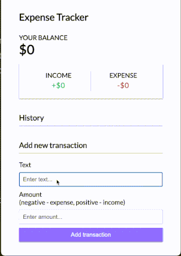

# Vue 3 Expense Tracker

This is an expense tracker app built with Vue3.

## Features
- Adding and removing incomes/expenses
- Tracking the total balance reactively
- Fetching and saving data to local storage with `localStorage`
- Using Vue-Toastification for notification showing
- Using Composition API

## Screenshot:



## Project Setup

```sh
npm install
```

### Compile and Hot-Reload for Development

```sh
npm run dev
```

### Compile and Minify for Production

```sh
npm run build
```
## Credits
Special thanks to Traversy Media for providing [Vue3 & Composition API Tutorial ](https://www.youtube.com/watch?v=hNPwdOZ3qFU&ab_channel=TraversyMedia)


